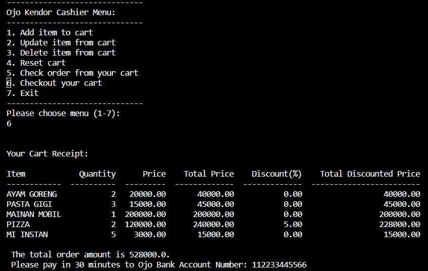
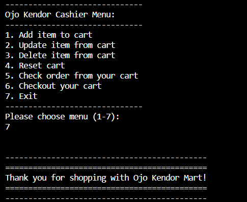

# Python Project : Super Cashier 

## A. Problem Background

Andi is an owner of one of the largest supermarket in the city, "Ojo Kendor Mart". Andi has a plan to improve his business by implementing a self-service cashier system, in the hopes of : 
    1. Customer can directly input items, quantity, and price to the cart
    2. Customer who are not in that city, can also shop from Ojo Kendor Mart.  

## B. Requirements and objectives

To fulfill Andi's request, here are the necessary requirements and objectives for the self-service cashier program:

### Technical Requirements
1. This program will be developed in Python Language
2. Using modular code based programming
3. Apply Clean Code Principle (PEP8)
4. Add docstring for each function to simplify future updates and improve readability
5. Stored the order cart to SQLite db using SQLAlchemy

### Business Objectives
1. Customers can initiate a new transaction.
2. Customers can add, update, or remove items from their cart, as well as empty the entire cart.
3. Customers can check the items included in their current transaction cart.
4. The cashier program will apply item-specific discounts when the total of each item cost crosses certain thresholds:
    - A 7% discount will be applied if the total price exceeds Rp 500,000.
    - A 6% discount will be applied if the total price exceeds Rp 300,000.
    - A 5% discount will be applied if the total price exceeds Rp 200,000.

5. Customers can finalize their transaction, which will then be stored in the database.

## Flowchart


## How to use SuperCashier
```python

# install requirements
pip install requirements.txt

# run the program
python main.py

```

# Test case scenario

## Create TransactionID 


## Add item


## Update item


## Delete item


## Reset Cart


## Check order


## Checkout


## Exit


# Conclusion

1. This Cashier program already meets the fundamental requirements set by Andi. 
2. User feedback is needed to develop more advanced features. 
3. Review by more experienced programmers for script optimization.